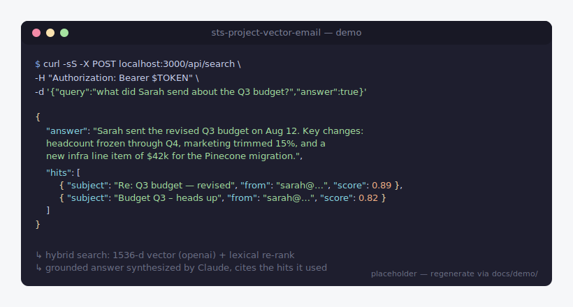

# sts-project-vector-email

Self-hosted RAG over your own email. Connect a Gmail account, sync it to a vector database, and ask grounded natural-language questions across your inbox — either through the HTTP API or directly from Claude Code via the bundled MCP server.



> The hero above is a static placeholder. Regenerate a real screen recording with the instructions in [docs/demo/](docs/demo/README.md).

Full design rationale lives in [TECH-SPEC.md](./TECH-SPEC.md).

## Status

| Area | State |
|---|---|
| Gmail (OAuth + sync + search) | ✅ Working |
| Outlook / Microsoft Graph | 🚧 Env + adapter sketch; OAuth routes not implemented |
| Generic IMAP | ❌ Not started |
| Attachment indexing (PDFs, etc.) | ❌ Not started — text-only today |
| GDPR erasure endpoint | 🚧 Helper exists, no route |
| Inbox cleanup (opt-in, off by default) | ✅ Working ([see below](#inbox-cleanup-opt-in)) |
| MCP server for Claude Code | ✅ Working ([mcp/](./mcp/)) |
| Observability | ✅ Structured logs (pino) + Prometheus `/metrics` |
| Test coverage | ✅ Unit + integration tests for sync, OAuth, quota |

If you need anything in the ❌ / 🚧 column, see [CONTRIBUTING.md](./CONTRIBUTING.md) — those are the highest-leverage PRs.

## What you'll need before starting

- **Node 20+** and **Docker**
- **Google Cloud project** with the Gmail API enabled and an OAuth 2.0 Web client — see [Setting up Google OAuth](#setting-up-google-oauth)
- API keys for: **OpenAI** (embeddings), **Pinecone** (vector store, free tier works), **Anthropic** (grounded answers)

Roughly 15–20 minutes to provision the external accounts the first time. Everything after that is one command.

## Quick start

```bash
pnpm install
pnpm setup
```

`pnpm setup` is an interactive wizard that walks you through the whole flow — preflight checks, generating secrets, validating API keys as you paste them, booting Docker, running the doctor health check, creating your user, opening the Google consent screen in your browser, waiting for the connection to complete, building the MCP server, and (optionally) registering it with Claude Code. Re-running it is safe: anything already configured is skipped.

Initial sync kicks off automatically after you connect — watch `docker compose logs -f worker` to see progress.

### Manual setup (advanced)

If you'd rather drive each step yourself:

```bash
# 1. Generate secrets and scaffold .env from .env.example
pnpm install           # once, so tsx is available
pnpm run bootstrap     # fills JWT_SECRET and TOKEN_ENCRYPTION_KEY with fresh random values

# 2. Open .env and paste in the provider keys:
#    OPENAI_API_KEY, PINECONE_API_KEY, ANTHROPIC_API_KEY,
#    GOOGLE_CLIENT_ID, GOOGLE_CLIENT_SECRET
#    (see "Setting up Google OAuth" below if you haven't created the OAuth client yet)

# 3. Boot everything (postgres, redis, migrate, api, worker, scheduler)
docker compose up -d --build

# 4. Verify every dependency is reachable before connecting an account
pnpm run doctor
# → green ticks for postgres, redis, openai, anthropic, pinecone, google.

# 5. Create your user — the command prints the Gmail connect URL
pnpm run create-user -- you@example.com
# → JWT + OAuth URL. Open the URL in your browser to connect Gmail.
#   Save the JWT as EMAIL_API_TOKEN for the MCP step below.
```

To check sync progress:

```bash
curl -H "Authorization: Bearer $EMAIL_API_TOKEN" http://localhost:3000/api/accounts
```

To search:

```bash
curl -X POST http://localhost:3000/api/search \
  -H "Authorization: Bearer $EMAIL_API_TOKEN" \
  -H "Content-Type: application/json" \
  -d '{"query": "what did Sarah send about the budget?", "answer": true}'
```

## Setting up Google OAuth

First-time setup in Google Cloud. If `google: oauth client id present` is green in `pnpm run doctor` you can skip this.

1. Go to [console.cloud.google.com](https://console.cloud.google.com), create a new project (or pick an existing one).
2. **APIs & Services → Library** → search for **Gmail API** → **Enable**.
3. **APIs & Services → OAuth consent screen** → choose **External** → fill in the app name and your email. Under **Scopes**, add:
   - `https://www.googleapis.com/auth/gmail.readonly` (required)
   - `https://www.googleapis.com/auth/gmail.modify` (**only if** you plan to enable inbox cleanup — see below)
   - `https://www.googleapis.com/auth/userinfo.email` (required)

   Add your own Gmail address as a **Test user** while the app is in testing mode. That's enough to use it yourself — you only need Google verification if you intend to let other people's accounts connect.
4. **APIs & Services → Credentials → Create Credentials → OAuth client ID** → **Web application**.
   - **Authorized redirect URIs**: `http://localhost:3000/api/oauth/google/callback`
5. Copy the **Client ID** and **Client Secret** into `.env` as `GOOGLE_CLIENT_ID` / `GOOGLE_CLIENT_SECRET`.

**Troubleshooting:** if the OAuth flow returns `access_denied`, double-check that your Gmail address is listed as a test user and that the consent screen's scope list includes every scope the app requests. Re-running `pnpm run create-user -- --cleanup` after adding `gmail.modify` is enough — no server restart needed.

## Local development (without Docker)

```bash
docker compose up -d postgres redis     # just the data stores
pnpm install
pnpm run db:migrate
pnpm run dev                             # terminal 1: api
pnpm run worker                          # terminal 2: bullmq worker
pnpm run scheduler                       # terminal 3: hourly poller
```

## Stack

- Node 20 + TypeScript + Express
- Postgres (accounts, sync state, dedup log)
- Redis + BullMQ (sync queue + scheduler)
- OpenAI `text-embedding-3-small` (1536-d vectors)
- Pinecone (one namespace per user)
- Anthropic Claude (grounded answers)
- Gmail API (provider adapter)

## Layout

```
src/
  config/        env + tunable constants
  db/            schema.sql + pg client
  auth/          JWT + AES-256-GCM token crypto
  providers/     gmail / outlook adapters, normalized email shape
  ingestion/     chunker, embedder, dedup, quota, sync orchestrator
  vector/        Pinecone upsert / query / delete
  query/         vector + lexical hybrid search, LLM grounding
  queue/         BullMQ queue, worker, hourly scheduler
  routes/        /api/oauth, /api/accounts, /api/search
  index.ts       Express entry
mcp/             Standalone MCP server for Claude Code
scripts/         Operational helpers (create-user, mint-token)
```

## Key tunables

| Setting | Default | Where |
|---|---|---|
| Per-user email cap | 50,000 | `EMAIL_LIMIT_PER_USER` in [src/config/constants.ts](src/config/constants.ts) |
| Excluded labels/folders | Spam, Promotions, Junk | `EXCLUDED_LABELS` / `EXCLUDED_OUTLOOK_FOLDERS` |
| Poll cadence | 60 min | `POLL_INTERVAL_MS` |
| Initial-sync batch | 100 | `INITIAL_SYNC_BATCH` |
| Default top-K | 10 | `DEFAULT_TOP_K` |

## Inbox cleanup (opt-in)

Off by default — if you only want search, you'll never see this feature and no write scopes are requested.

**To enable:**

1. Set `ENABLE_INBOX_CLEANUP=true` in `.env` and restart (`docker compose up -d`).
2. Make sure your Google Cloud consent screen includes `https://www.googleapis.com/auth/gmail.modify` (see [Setting up Google OAuth](#setting-up-google-oauth) step 3).
3. Connect Gmail with the `--cleanup` flag so the OAuth flow requests `gmail.modify` instead of read-only:

   ```bash
   pnpm run create-user -- you@example.com --cleanup
   # → prints the Gmail connect URL with ?cleanup=true appended
   ```

Users who already connected without cleanup can re-run the start URL with `&cleanup=true` to upgrade the scope — no account recreation needed. Accounts that never granted `gmail.modify` get a 403 from the cleanup endpoints even when the feature flag is on, so a stale token can't be used destructively.

Preview before running (no writes, shows the translated Gmail query + a 20-message sample):

```bash
curl -X POST http://localhost:3000/api/cleanup/preview \
  -H "Authorization: Bearer $EMAIL_API_TOKEN" -H "Content-Type: application/json" \
  -d '{
    "accountId": "<uuid>",
    "rules": {
      "labels": ["CATEGORY_PROMOTIONS"],
      "hasUnsubscribe": true,
      "olderThanDays": 30,
      "keep": { "senders": ["boss@company.com"] },
      "maxMessages": 200
    }
  }'
```

Then execute with `{"confirm": true}`:

```bash
curl -X POST http://localhost:3000/api/cleanup/run \
  -H "Authorization: Bearer $EMAIL_API_TOKEN" -H "Content-Type: application/json" \
  -d '{"accountId": "<uuid>", "confirm": true, "rules": { /* same */ }}'
```

Messages go to **Trash** (reversible for ~30 days via Gmail), not permanently deleted. Starred and Important messages are excluded automatically. Rule schema is in [src/cleanup/rules.ts](src/cleanup/rules.ts).

## MCP server (Claude Code integration)

A standalone MCP server in [mcp/](mcp/) exposes three tools — `search_email`, `list_email_accounts`, `get_account_sync_status` — so Claude Code can query your inbox directly.

`pnpm setup` builds this automatically and prints a ready-to-paste `claude mcp add` command at the end. To do it by hand:

```bash
# 1. Build the MCP server
cd mcp && pnpm install && pnpm run build && cd ..

# 2. Mint a token (skip if you saved one from `create-user`)
pnpm run mint-token <your-user-uuid>

# 3. Register with Claude Code
claude mcp add sts-vector-email \
  --env EMAIL_API_URL=http://localhost:3000 \
  --env EMAIL_API_TOKEN=<paste-jwt> \
  -- node /absolute/path/to/sts-project-vector-email/mcp/dist/server.js
```

Restart your Claude session and the tools appear as `mcp__sts-vector-email__search_email` etc. The API server must be running for Claude to reach it.

## Quality gates

- **Biome** — lint + format + organize-imports. Config in [biome.json](biome.json).
- **Lefthook** — runs Biome + typecheck on commit, full check + tests on push. Installed automatically by `pnpm install` (via the `prepare` script). Config in [lefthook.yml](lefthook.yml).
- **Vitest** — unit tests in [tests/](tests/). Env is faked in [tests/setup.ts](tests/setup.ts) so the Zod env schema doesn't need real secrets.
- **GitHub Actions** — same checks run on every PR ([.github/workflows/ci.yml](.github/workflows/ci.yml)).

| Command | What it does |
|---|---|
| `pnpm test` | Vitest once (CI + pre-push) |
| `pnpm run check` | Biome lint + format + organize-imports (no writes) |
| `pnpm run check:fix` | Same, but auto-fixes |
| `pnpm run typecheck` | `tsc --noEmit` |

Escape hatch: `LEFTHOOK=0 git commit ...` skips the hooks. Don't rely on this — CI runs the same checks.

## License

MIT — see [LICENSE](./LICENSE).

## Security

See [SECURITY.md](./SECURITY.md) for how to report vulnerabilities. **Do not** open public issues for security bugs.
